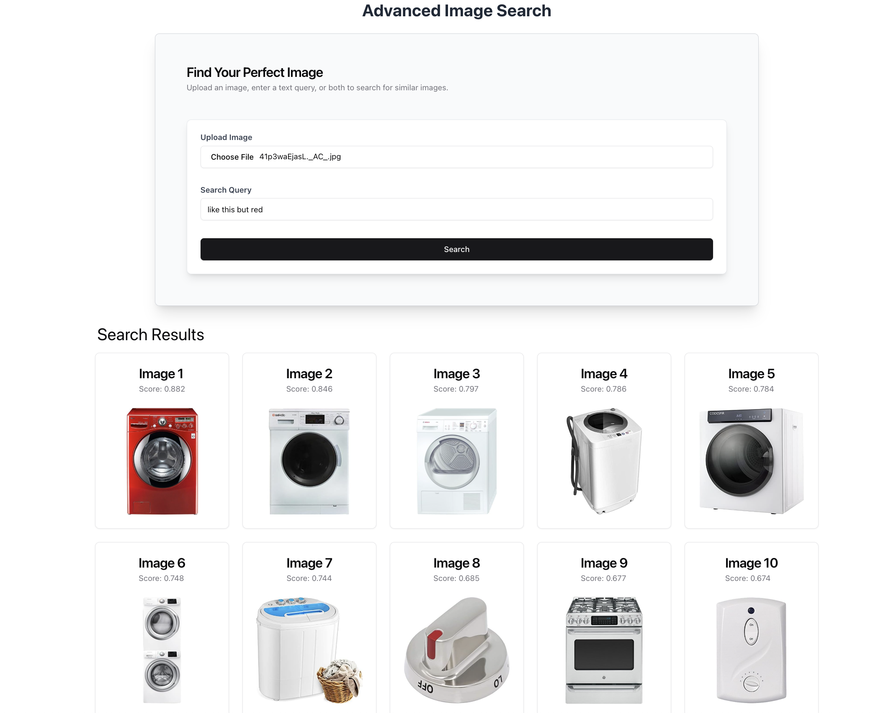
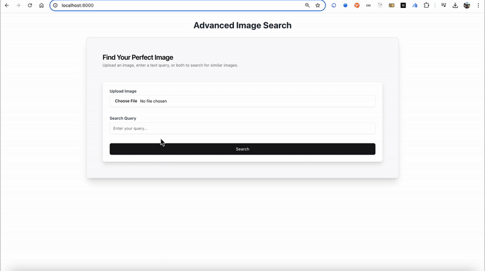

# Multimodal Image Search



This project is a web application that allows users to search for images based on a combination of image and text descriptions. Users can upload an image and can optinally provide a text instruction, which is processed by Visualized BGE multimodal model. Visualized-BGE, a universal multi-modal embedding model that encode multi-modal data in a variety of formats, whether it's purely text, solely image-based, or a combination of both. Milvus is used as the vector database to store and retrieve the embeddings.



## Installation

1. Clone the repository:

```bash
git clone https://github.com/your-username/multimodal-image-search.git
```

2. Install the required packages:

```bash
pip install -r requirements.txt
git clone https://github.com/FlagOpen/FlagEmbedding.git
pip install -e FlagEmbedding
```

- Install Visualized-BGE:

```bash
cd FlagEmbedding/research/visual_bge
pip install -e .
```

For more details, please refer to the [Visualized-BGE](https://github.com/FlagOpen/FlagEmbedding/tree/master/research/visual_bge)

3. Download Data:

```bash
wget https://github.com/milvus-io/bootcamp/releases/download/data/amazon_reviews_2023_subset.tar.gz
tar -xvzf amazon_reviews_2023_subset.tar.gz
```

4. Download the Embedding model:

```bash
wget https://huggingface.co/BAAI/bge-visualized/resolve/main/Visualized_base_en_v1.5.pth?download=true
```

5. Load data, model and insert into Milvus:

- Uncomment the following line in `milvus_index.py`:

```python
insert_to_milvus()
```

- Run the script below and after that, you should comment the line above:

```bash
python milvus_index.py
```

6. Run the web application:

```bash
python main.py
```

## Tech Stack

- Vector Database: [Milvus](https://github.com/milvus-io/milvus)
- Embedding Model: [Visualized-BGE](https://github.com/FlagOpen/FlagEmbedding/tree/master/research/visual_bge)
- Frontend and Backend: [FastHTML](https://fastht.ml/) and [Shadcn-ui](https://www.shad4fasthtml.com/)

## License

[](LICENSE)
